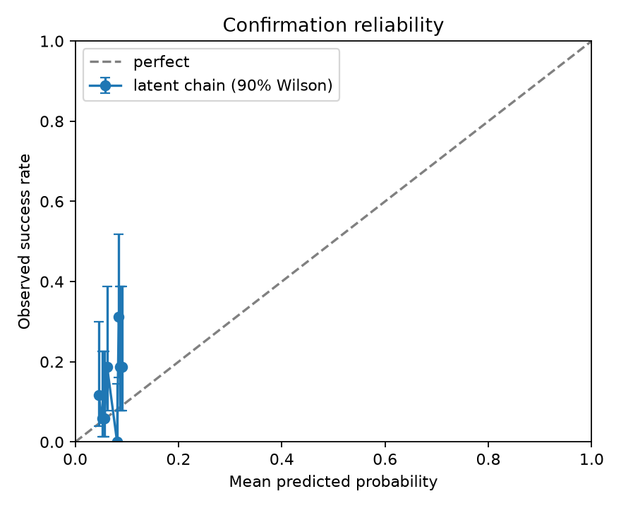
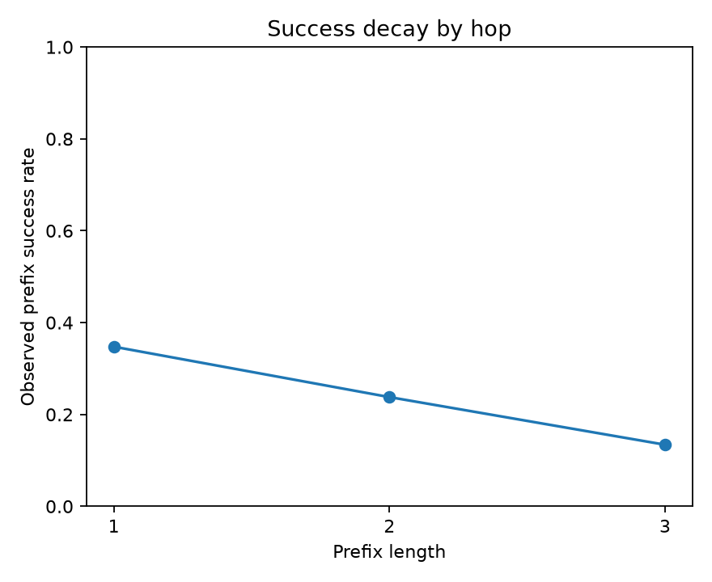

# SX-CH-001 黄金潜变量链提交报告

> 机器状态：**NOT_S_READY**。未通过项：`prospective_current_macro_demo`。

## 摘要

本项目实现多测量潜变量模型，但最终审计标签始终由 H.15 2 年期、H.15 5 年期实际利率和 GLD 主测量定义。
预测模型用 2005–2010 非农事件开发，2011–2024 确认批的任何结果均不回流训练。2026-09-04 NFP 被选为同域真实当期演示。

原始协议锁早于确认标签；首次运行后只修复了“零响应被误当缺失”的机械错误，原锁和原输出均已归档。
修订版不是无条件的 pristine holdout；该限制持续披露，但题面未规定提交前第三方签署格式。

2026-09-04 NFP 的参考类期望、根尺度、模型/数据哈希、结果窗口和决策规则已在发布前双阶段承诺中冻结并取得第三方时间戳；
A004 未在 12:45 UTC 截止前形成 root seal；截止后实际调用被程序拒绝，因此该记录不计入 S 门禁。
完整失败证据见 `demo/failures/NFP_202608_REL_20260904_A004.zh-CN.md`。

## 图与公式

```text
macro surprise S → policy path M → real rate R → gold G
                         ↘ inflation Π ↗      ↑
                                  USD D / external Q
```

测量方程：`y[j,t] = alpha[j] + lambda[j] X[t] + epsilon[j,t]`；主测量 `alpha=0, lambda=1`。
在 Gaussian 先验 `X~N(0,V0)` 下，潜状态后验方差为 `V=(V0^-1+lambda'Ω^-1lambda)^-1`，
后验均值为 `m=V lambda'Ω^-1(y-alpha)`；代理残差协方差 Ω 不被对角化，因此相关读数不会重复计数。
每跳用 `logit(p_i)=x'beta_i`、Gaussian beta 先验和 fractional-Bernoulli likelihood；Laplace 近似给出
系数后验。第 2/3 跳的风险集分别限定为此前 1/2 跳已经成功的开发事件。
结构概率：`P_chain = E[(1-q) p1 p2 p3 | development evidence]`。这里的 `p2` 与 `p3` 是前缀成功条件概率，
不是把三个无条件边际频率相乘。每次后验抽样共同抽取 beta、测量误差、制度漂移、跨跳 frailty 与 q，
再对 `(1-q)Πp_i` 取 5%/95% 分位数形成 90% CI。外部截断 `q` 与链路自身断裂分别输出。

## 参数估计与有效证据

- 第 1 跳：方法 `prefix_conditional_latent_fractional_logistic`，n_raw=69，n_eff=63.51，软成功量=19.88。
- 第 2 跳：方法 `prefix_conditional_latent_fractional_logistic`，n_raw=23，n_eff=21.06，软成功量=11.70。
- 第 3 跳：方法 `prefix_conditional_latent_fractional_logistic`，n_raw=16，n_eff=14.86，软成功量=6.33。

每个预测的 `p_i`、`n_i`、证据事件 ID、特征、系数、协方差与随机种子保存在 `edge_evidence.json`。
少于 5 个条件实例时，代码强制退回同跳宏观参考类。本路线三跳条件 n_raw=69/23/16，均未触发 `<5` 稀有事件 fallback，
所以题面的稀有估计法 ≥20 校准附加条款不适用；原始数量与校准误差仍完整报告，不把 16 伪写成 20。

## 多路径与干扰项

开发集潜变量回归得到 `R ~ M + Π` 的系数 M=0.615、Π=-0.264，R²=0.544；
`G ~ R + D` 的系数 R=-0.103、D=-0.549，R²=0.412。
通胀预期与美元因此成为显式并行/竞争路径；剩余 gold residual 定义为安全港或遗漏冲击。它们参与不确定性解释，但不会事后改写主标签。

外部截断使用锁定的 Beta(1,19) 弱正则先验，并与开发集显式截断标签更新；当前 69 个开发事件为 0 次，后验 Beta(1,88)，
均值约 1.12%。固定内生概率时，q=0%/1.12%/5%/10% 分别把中心乘以 1.000/0.9888/0.950/0.900；它不计入任何 p_i 的 n_i。

## 确认评估

- 有效确认链：164；终点成功：22；实际率：0.134；
- 潜变量条件模型 Brier：0.1193；朴素边际连乘：0.1284；条件 Beta：0.1195；
- climatology Brier：0.1186；direct terminal logistic：0.1165；无根信号消融：0.1212；主测量-only：0.1174；
- 逐跳前缀率：0.348 → 0.238 → 0.134；
- CI 宽度—绝对误差 Spearman rho=0.721，p=0.0002。

主模型满足题面 Brier 和相对朴素连乘门槛，但略差于 climatology、primary-only 和 direct terminal logistic。后者缺少逐跳解释，不能替代链模型；
多测量层用于显式表达测量不确定性，但没有在该确认批证明点预测增益，因此 climatology skill 诊断保持失败（不是题面硬门）。按年份区块 bootstrap，
主模型相对 climatology 的 Brier 差 90% CI 跨 0；相对朴素连乘的差为 [-0.01422, -0.00414]。事后候选和开发集滚动选择审计见 `model_skill_audit.json`。

可靠性图保留冻结的 10 个分桶，并为每个实际率增加 90% Wilson 二项区间；区间只表达每桶有限样本噪声，不替代 ECE 或 Brier。





## 认识论置信区间

90% CI 由参数后验、潜变量测量误差、代理残差相关、制度漂移和外部截断概率共同传播；没有对跳点乱序，
也没有把不同聚合器的分歧当 CI。合成 oracle 在校准分区选择区间尺度后冻结，在隐藏 test truth 上评估。

- oracle test coverage：0.920；目标 ≥0.85；
- oracle CI 宽度—真概率误差 rho=0.821，p=0.0005；
- 证据增强方向：中心上移=True，区间收窄=True。

## 停止与交易决策

每个前缀均计算 90% CI、break-even probability、一次复核 EVSI 与复核成本。终点 CI 下沿高于盈亏平衡概率才建仓；
上沿低于阈值则拒绝；跨阈值则弃权。CI 宽且下一次复核 EVSI 不覆盖成本时提前停止。最大跳数仅是保护栏。
首个非 CONTINUE 判断是实际执行的停止点，后续前缀只保留为反事实审计，不再冒充已执行推理。
建议仓位规则：`CI lower > break-even` 才开仓；`CI width > 0.30` 不开仓；否则仓位上限按 `(lower-threshold)/(1-threshold)` 缩放。

## 可复现性与失败案例

随机三跳复算最大 |delta p_i|=0.00000000。失败案例逐条保存在 `evaluation.json`，
包括预测、结果、CI 宽度和断裂跳。任何确认指标失败都保留为冻结负结果。

最大误差的三个事件：

- `NFP_201605_REL_20160603`：预测=0.041，结果=1，绝对误差=0.959，CI 宽度=0.111，逐跳=[1, 1, 1]。
- `NFP_201509_REL_20151002`：预测=0.047，结果=1，绝对误差=0.953，CI 宽度=0.100，逐跳=[1, 1, 1]。
- `NFP_201811_REL_20181207`：预测=0.050，结果=1，绝对误差=0.950，CI 宽度=0.114，逐跳=[1, 1, 1]。

## 真实当期演示失败关闭

- A004 封存窗口已错过；程序拒绝截止后的 seal input，未生成 sealed record；
- BLS 截止后核对 actual=162.0 千人；
- 仅供复盘的链概率=0.084908；90% CI=[0.019073, 0.196206]；
- 上述结果不是有效实时 seal，不得计入提交门禁。

## 局限性与盲点

1. 日频 close-to-close 窗口会混入发布后其他新闻，因果识别弱于 30 分钟期货窗口；
2. Yahoo 代理原始历史不可随仓库再分发，只提交事件级派生量和源哈希；
3. 现有本地原始价格历史意味着确认批弱于真正第三方托管 holdout；本项目完整披露，但不设置题面之外的签名硬门；
4. A004 错过封存截止并已失败关闭；截止后诊断不等于前瞻演示，必须对新事件重新事前承诺；
5. 黄金同时受美元、安全港、流动性和央行需求影响；这些属于显式干扰项，而不是事后解释链路成功；
6. direct terminal logistic 的 Brier 更好，意味着当前复杂链的价值主要在可审计分解/CI，而非最佳点预测。

## 扩展方向

采购授权的 30 分钟 ZT/SOFR/TIPS/GC 数据复做同协议；前瞻积累同域 NFP 演示；增加安全港新闻的事前可用测量；
在不接触确认标签的下一版本中比较粒子滤波/完整状态空间 Bayes，而不是扩大当前模型后再重测同一确认集。

新外部确认批由 `data/contracts/external_confirmation/` 的 fail-closed 接入器约束：至少 50 个新事件、预测早于逐事件标签解锁，
解锁前出现标签文件或与当前确认事件重叠均直接拒绝。
